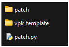
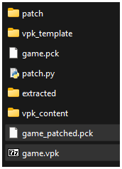
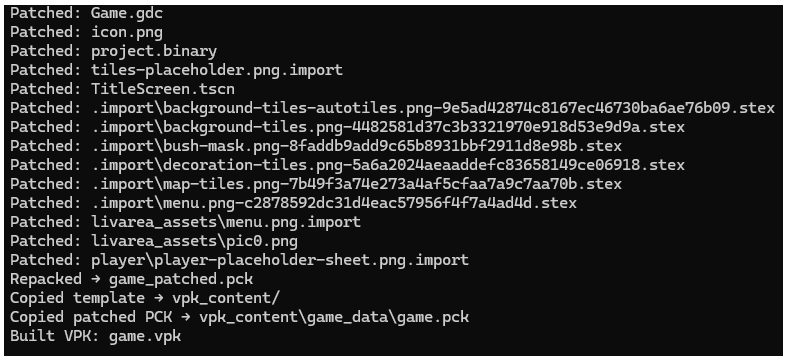
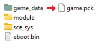
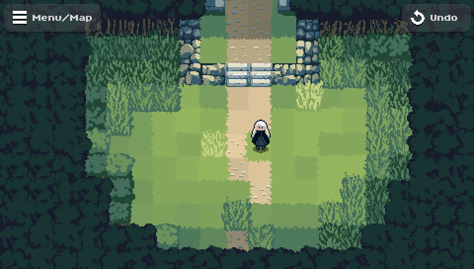
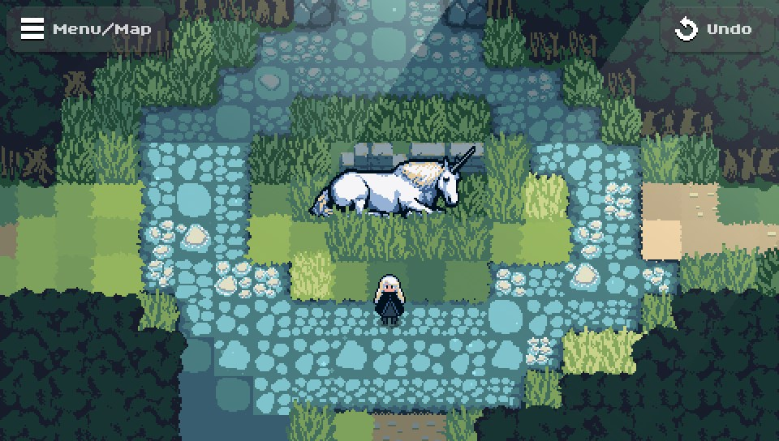
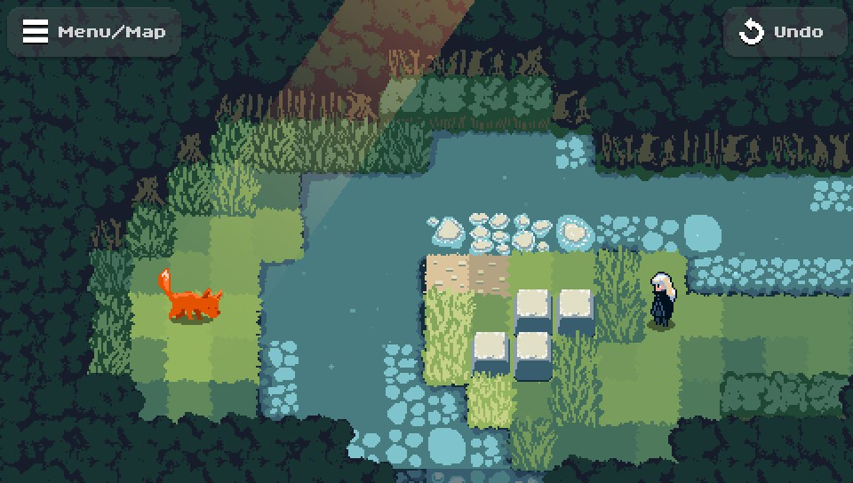
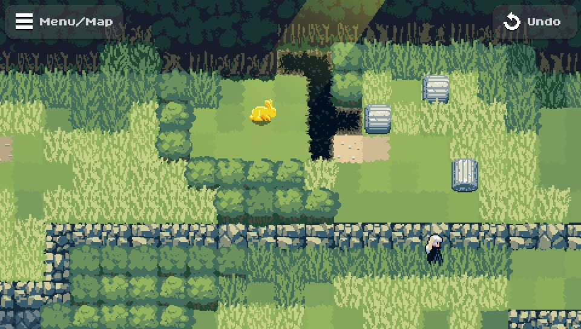

# The Legend of Lumina — PSVita Patch

**A patch for _The Legend of Lumina_ to run on the PlayStation Vita.**  
Explore an ancient forest, push blocks to solve puzzles, and uncover a way to lift the curse on your homeland.

Originally developed in **Godot** for the **KB Games ZeldaJam 2022**, _The Legend of Lumina_ is a block-pushing puzzle game with **Metroidvania-style** progression, set in a peaceful forest environment.

---

## 🌐 Official Game Download

- [Itch.io](https://wizbane.itch.io/the-legend-of-lumina)  
- [Steam](https://store.steampowered.com/app/2638340/The_Legend_of_Lumina/)

---

## 🎮 PSVita Patch Installation Guide

### 1. Download Required Files
- Get the game from [Itch.io](https://wizbane.itch.io/the-legend-of-lumina) or [Steam](https://store.steampowered.com/app/2638340/The_Legend_of_Lumina/).
- Clone or download this **PSVita patch repository**.

### 2. Prepare the Game Files
- Locate `The-Legend-of-Lumina.pck` in the downloaded game folder.
- Rename it to `game.pck` and place it inside the patch repository folder.



### 3. Run the Patch Script

Using **Python 3**, execute the following command:

```bash
python patch.py --pck game.pck --all --output game_patched.pck --build-vpk
```



Once completed, you'll see:



### 4. Install on Your PSVita

You now have two options:

- **Install via VPK:**  
  Use **VitaShell** to install the generated `game.vpk`.

- **Manual Install:**  
  - Download the game from **VitaDB**.  
  - Replace the `.pck` file in `ux0:data/game_data/` with your `game_patched.pck`, renamed to `game.pck`.



---
## Known issues:
- low fps on some levels (16 fps).
- fps drops on undo actions.
- sound is not working as intended on some levels.

---
## 📸 Screenshots

Explore the game's charming forest world:

  
  


